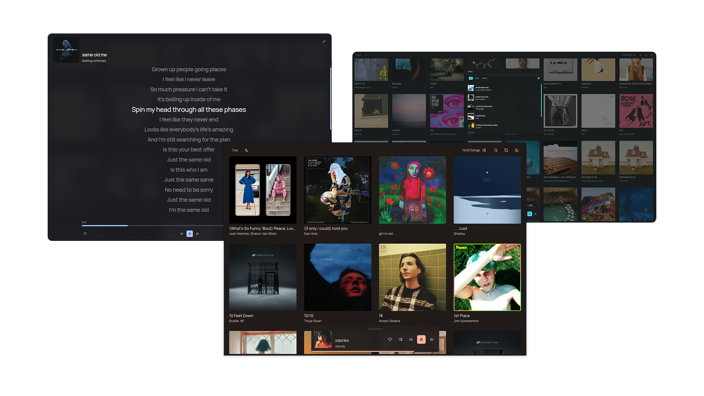

# A music player, web-based

This is still a work in progress, yet it is functional.



## Development

You need to have a `node>=20` and `pnpm`.

```shell
# install dependencies
pnpm install
```

```shell
# setup
pnpm run setup
```

```shell
# start the server
pnpm run dev
```

### References

[Client README](./apps/client/README.md)

> [!NOTE]
> The client should support using other servers, but the server is only compatible with the client.
> If you want to use the client with another server, you can just implement the same API as the server, you can look at
`apps/client/src/clients/rest` or `apps/client/src/clients/rest` for an example.

[Server README](./apps/server/README.md)

